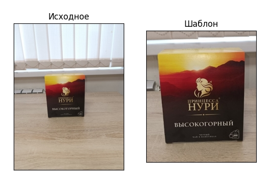
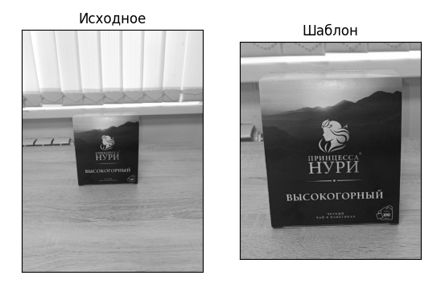
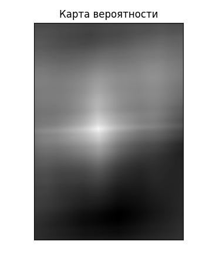
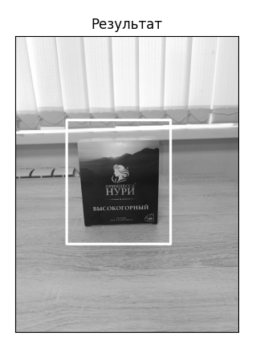
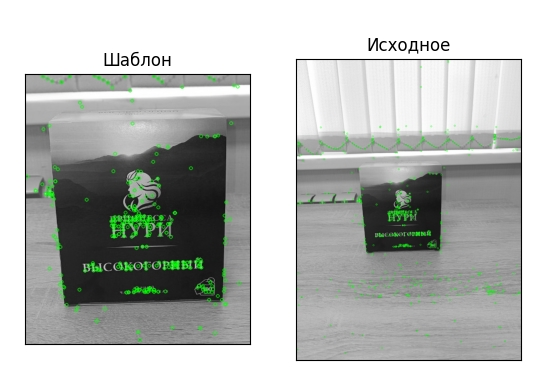
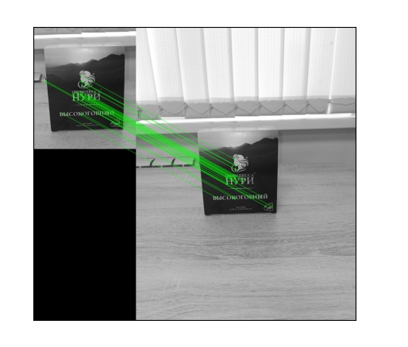
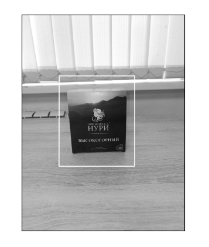
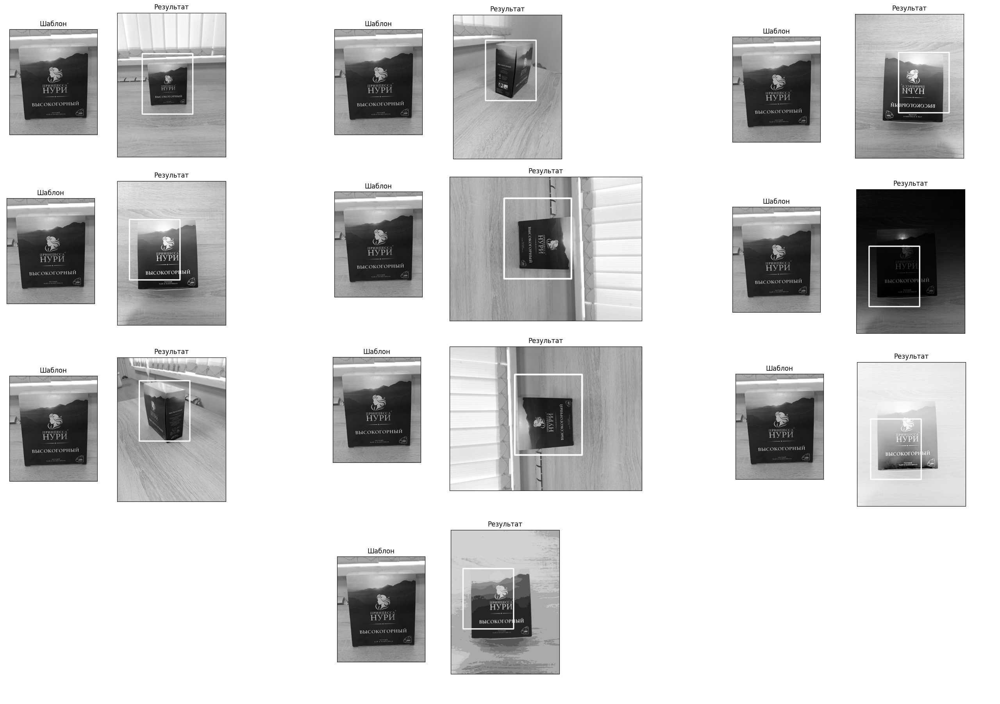
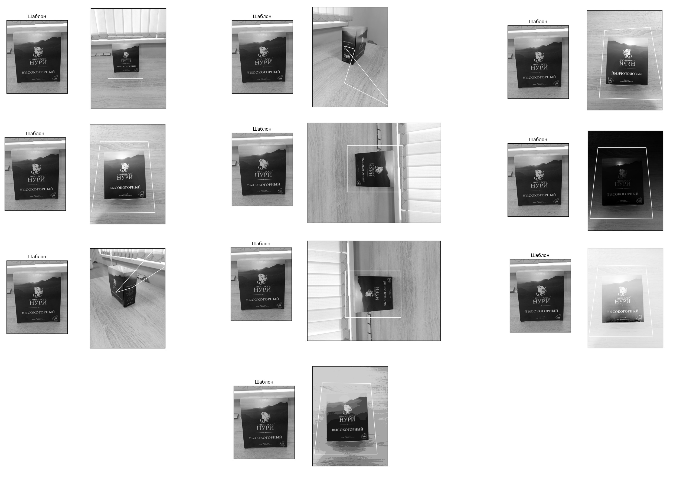

<h1 align="center">Лабораторная работа №2.</h1>

<h2 align="center">Простейшие алгоритмы детектирования объектов на изображении.</h2>

<p align="center"><b>Теоретическая база</b><p>

В OpenCV существует ряд методов обнаружения особенностей изображения, и у каждого метода есть свои преимущества и недостатки. Изображения, которые мы передаем в эти алгоритмы, должны быть черно-белыми. Это помогает алгоритмам больше сосредоточиться на функциях.

<b><i> Алгоритм: Сопоставление шаблонов (TemplateMatching)</b></i> — это метод поиска и нахождения расположения эталона на исходном изображении. OpenCV поставляется с функцией cv.matchTemplate() для этой цели. Он просто наводит изображение шаблона на входное изображение (как в 2D-свертке) и сравнивает шаблон и фрагмент входного изображения с изображением шаблона. В OpenCV реализовано несколько методов сравнения. Он возвращает изображение в градациях серого, где каждый пиксель обозначает, насколько окрестности этого пикселя совпадают с шаблоном.

<b>Перечисляем методов сравнения:</b>
<i>
<b>1. TM_SQDIFF -</b> квадратная разность;
<b>2. TM_SQDIFF_NORMED -</b> нормализованная квадратная разность;
<b>3. TM_CCORR -</b> кросс-корреляция;
<b>4. TM_CCORR_NORMED -</b> нормализованная кросс-корреляция;
<b>5. TM_CCOEFF -</b> коэффициент корреляции;
<b>6. TM_CCOEFF_NORMED</b> - нормализованный коэффициент корреляция; </i>

<b><i> Алгоритм: SIFT (масштабно-инвариантное преобразование признаков)</b></i> — один из важных алгоритмов, обнаруживающих объекты, не относящиеся к масштабу и повороту изображения и эталона. Это очень помогает, когда мы сравниваем объекты реального мира с изображением, хотя это не зависит от угла и масштаба изображения. Этот метод вернет ключевые точки изображений, которые нам нужно отметить на изображении.

<p align="center"><b>Описание разработанной системы</b><p>

Работа состоит из 2 пункта и каждый пункт из 5 частей:

<b>1. Сопоставление шаблона и создание рамки для изображений с использованием метода <i>"коэффициент корреляции":</i></b>

    А) Загружаем изображении.
    Б) Создание карты вероятности расположения эталона на фрагменте исходного изображения.
    С) Нахождение наиболее вероятной позиции для эталона.
    Д) Создание рамки для эталона на исходном изображении.
    Е) Вывод изображения после проведённых операций.

А) Загружаем исходное изображение и вырезанный из него эталон в градациях серого.
```
import cv2 as cv
img = cv.imread('img1.jpg', 0)
template = cv.imread('template.jpg', 0)
```
<figure>
  <p align="center"></p>
</figure>
<p align="center"><i>Исходное изображение и эталон</i></p><br>

<figure>
  <p align="center"></p>
</figure>
<p align="center"><i>Исходное изображение и эталон в градациях серого</i></p><br>

Б) Создание карты вероятности расположения эталона на фрагменте исходного изображения с помощью функции <i>cv.matchTemplate()</i> с методом сравнения TM_CCOEFF.
```
map = cv.matchTemplate(img, template, cv.TM_CCOEFF)
```
<figure>
  <p align="center"></p>
</figure>
<p align="center"><i>cv.TM_CCOEFF</i></p><br>

С) Нахождение наиболее вероятной позиции для эталона.

Теперь нам необходимо на получившемся изображении найти наиболее вероятную позицию. Для этого мы вызываем функцию cv.minMaxLoc(). Функция возвращает четыре значения:
1) minVal – значение минимального экстремума
2) maxVal – значение максимального экстремума
3) minLoc – позиция минимального экстремума
4) maxLoc – позиция максимального экстремума

Мы использовали метод сравнения TM_CCOEFF, тогда нас интересует только позиция максимального экстремума.
```
_, _, _, max_loc = cv.minMaxLoc(map)
```

Д) Создание рамки для эталона на исходном изображении.

В качестве верхнего левого угла рамки берём позицию максимального экстремума. Далее задаём правый нижний угол рамки и рисуем получившуюся рамку на исходном изображении.
```
top_left = max_loc
bottom_right = (top_left[0] + template.shape[1], top_left[1] + template.shape[0])
cv.rectangle(img, top_left, bottom_right, 255, 10)
```
Е) Вывод изображения после проведённых операций.

Выводим на экран изображение с помощью встроенной функции opencv.
```
plt.imshow(cv.cvtColor(img, cv.COLOR_BGR2RGB))
plt.xticks([])
plt.yticks([])
plt.title('Результат')
plt.show()
```
<figure>
  <p align="center"></p>
</figure>
<p align="center"><i>Вывод результата</i></p><br>

<b>2. Нахождение ключевых точек и вычисление их дескрипторов в изображении:</b>

    А) Загружаем изображении.
    Б) Нахождение ключевых точек и вычисление их дескрипторов.
    С) Нахождение соответсвий между дескрипторами двух изображений.
    Д) Создание рамки для эталона на исходном изображении.
    Е) Вывод изображения после проведённых операций.

А) Загружаем исходное изображение и вырезанный из него эталон в градациях серого.
```
img1 = cv.imread('template.jpg',0)          # шаблон
img2 = cv.imread('img1.jpg',0)              # исходное
```
<figure>
  <p align="center"></p>
</figure>
<p align="center"><i>Исходное изображение и эталон в градациях серого</i></p><br>

Б) Нахождение ключевых точек и вычисление их дескрипторов.

Для этого мы используем SIFT с помощью конструктора cv.SIFT_create(). Находим ключевые точки и вычисляем их дескрипторы для эталона и исходного изображения используя функцию detectAndCompute().
```
sift = cv.SIFT_create()
kp1, des1 = sift.detectAndCompute(img1,None)
kp2, des2 = sift.detectAndCompute(img2,None)
```
<figure>
  <p align="center"></p>
</figure>
<p align="center"><i>Ключевые точки на изображениях</i></p><br>

С) Нахождение соответсвий между дескрипторами двух изображений.

Для нахождения соответсвий между дескрипторами используем FLANN cv.FlannBasedMatcher(). Для сопоставления на основе FLANN нам нужно передать два словаря, которые определяют используемый алгоритм. Первый из них — IndexParams. Второй — SearchParams. Он определяет количество рекурсивных обходов деревьев в индексе. Более высокие значения обеспечивают лучшую точность, но также требуют больше времени. 
```
FLANN_INDEX_KDTREE = 1
index_params = dict(algorithm = FLANN_INDEX_KDTREE, trees = 5)
search_params = dict(checks = 50)
flann = cv.FlannBasedMatcher(index_params, search_params)
matches = flann.knnMatch(des1,des2,k=2)
```
<figure>
  <p align="center"></p>
</figure>
<p align="center"><i>Соответствие между дескрипторами</i></p><br>

Д) Создание рамки для эталона на исходном изображении.

Чтобы нарисовать рамку будем использовать гомографию. Для начала потребуется сделать два массива точек для эталона и исходного изображения, опираясь на найденые соответсвия.
```
src_pts = np.float32([ kp1[m.queryIdx].pt for m in good ]).reshape(-1,1,2)
dst_pts = np.float32([ kp2[m.trainIdx].pt for m in good ]).reshape(-1,1,2)
```

Далее, рассчитаем матрицу гомографии с помощью функции cv.findHomography().
```
M, mask = cv.findHomography(src_pts, dst_pts, cv.RANSAC,5.0)
```

Создаём массив из 4 угловых точек эталона и трансформируем их координаты используя функцию cv.perspectiveTransform(). Данные координаты можно считать углами рамки на исходном изображении.
```
pts = np.float32([ [0,0],[0,h-1],[w-1,h-1],[w-1,0] ]).reshape(-1,1,2)
dst = cv.perspectiveTransform(pts,M)
```

Теперь рисуем прямоугольник.
```
img2 = cv.polylines(img2,[np.int32(dst)],True,255,3, cv.LINE_AA)
```
Е) Вывод изображения после проведённых операций.

Выводим на экран изображение с помощью встроенной функции opencv.

<figure>
  <p align="center"></p>
</figure>
<p align="center"><i>Результат</i></p><br>


<h4 align="center">Результаты работы и сравнения системы</h4>

Для тестирования алгоритмов детектирования использовались следующие датасеты:
<figure>
  <p align="center"></p>
</figure>
<p align="center"><i>Датасеты</i></p><br>

Начнём тестирование с <b>TemplateMatching</b>:

<figure>
  <p align="center"></p>
</figure>
<p align="center"><i>Результаты тестов</i></p><br>

На тестах видно, что алгоритм TemplateMatching смог предсказать 5 из 10 изображений верно. В результате тестов можем сказать что алгоритм устойчив к изменени ракурса изображения.

Теперь смотрим <b>SIFT</b>:

<figure>
  <p align="center"></p>
</figure>
<p align="center"><i>Результаты тестов</i></p><br>

Метод SIFT правильно предсказал 8 из 10 изображений. По результатам видно, что метод очень неустойчив к изменением ракурса изображения, однако отлично справляется со сменой освещения и поворотами. При изменении ракурса съёмки, сильно меняются дескрипторы ключевых точек и соответсвия между изображениями становятся менее точными.

<h4 align="center"><i>Вывод</i></h4>
Мы в ходе выполнение лабораторной работы узнали следующие: Работать с алгоритмом TemplateMatching менее эфективен для определения объекта. С алгоритмом SIFT можем определить объекты даже изменённым освещений и повораченные изображении. 
